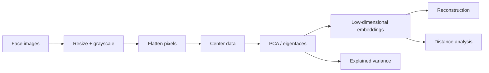

# Face Evolution & Eigenface Analysis with PCA

[](https://github.com/AnujjjGit/face-evolution-pca/actions/workflows/ci.yml)

A modernized computer-vision analysis of face-image variation using Principal Component Analysis. The original project worked with **10 face groups × 20 images** and explored PCA-based reconstruction. This version turns that experiment into a reusable pipeline for eigenfaces, explained variance, reconstruction error, and representation-space distance analysis.

**Stack:** Python 3.11+ · NumPy · scikit-learn · Pillow · matplotlib · pytest · Ruff

> This project analyzes image representations; it is **not a face-identification, demographic-inference, or biometric decision system**.

---

## Core question

A grayscale `128 × 128` face image contains **16,384 pixel dimensions**. PCA asks whether much of the variation across those pixels can be represented in a substantially smaller linear subspace.

The workflow is:



## From the original project to the current version

The original notebook:

- loaded 200 face images from 10 folders;
- resized each image to `128 × 128`;
- converted images to grayscale;
- flattened each image into a pixel vector;
- applied PCA;
- projected images into a low-dimensional representation;
- inverse-transformed the embeddings to inspect reconstructed imagery.

The upgraded implementation keeps that mathematical core while making the analysis more defensible and reusable:

- configurable image size and component count
- explained-variance reporting
- reconstruction-error measurement
- eigenface visualization
- pairwise distance matrix in PCA space
- clean command-line pipeline
- deterministic tests using synthetic images
- CI + linting

## Why eigenfaces are useful here

PCA finds orthogonal directions that explain the largest variance in the image matrix. When those directions are reshaped back into image dimensions, they are commonly called **eigenfaces**.

Rather than treating the first two principal components as sufficient by default, the modernized workflow asks:

1. How much variance is explained as components are added?
2. How quickly does reconstruction error fall?
3. What visual structure do the leading eigenfaces capture?
4. How stable are pairwise relationships in the compressed representation?

That is a better analytical question than simply “can PCA reduce the data to 2D?”

## Run the pipeline

Organize images as:

```text
data/faces/
  face1/
    1.jpg
    2.jpg
    ...
  face2/
    ...
```

Then:

```bash
python -m venv .venv
source .venv/bin/activate
pip install -e '.[dev]'

python -m face_pca.pipeline \
  --input data/faces \
  --output outputs \
  --components 20 \
  --width 128 \
  --height 128
```

The pipeline writes:

- `explained_variance.csv`
- `embeddings.csv`
- `distance_matrix.csv`
- `eigenfaces.png`
- `reconstruction_examples.png`
- `variance_curve.png`

## Evaluation

For an unsupervised representation project, “accuracy” is not the right default metric. The implementation focuses on:

### Explained variance
How much of the dataset's pixel variance is represented by the first `k` components?

### Reconstruction error
How much information is lost when compressed images are reconstructed from `k` components?

### Representation geometry
What pairwise relationships appear in PCA space, and how do those relationships change as dimensionality changes?

A future extension could add labeled identity evaluation, but only with an appropriate dataset and a clearly defined non-sensitive research objective.

## Repository structure

```text
src/face_pca/
  pipeline.py       image loading, PCA, metrics, visual outputs

tests/
  test_pipeline.py  synthetic-data tests

.github/workflows/ci.yml
pyproject.toml
```

## Limitations

PCA is intentionally simple, which makes its assumptions visible:

- linear representation only
- sensitive to image alignment, illumination, pose, and background
- pixel-space distance can overemphasize nuisance variation
- leading components explain variance, not necessarily semantic identity
- reconstruction quality is not the same as recognition quality

Modern representation-learning methods can learn more invariant features, but PCA remains useful as an interpretable baseline and as a way to reason about dimensionality reduction directly.

## If I extended it today

I would compare PCA against a pretrained vision embedding model on the **same fixed image set** and evaluate:

- dimensionality versus reconstruction/neighbor preservation
- robustness to lighting and cropping perturbations
- retrieval consistency
- inference cost and representation size

The point would be to understand the trade-off between an interpretable linear baseline and modern learned embeddings—not to retrofit deep learning merely for complexity.

## Project lineage

The original Colab notebook is preserved in the historical repository and contains the initial 200-image PCA experiment and reconstruction output.

Original archive: [AnujjGithub/Tracking-Human-Face-Evolution](https://github.com/AnujjGithub/Tracking-Human-Face-Evolution)

## What this project demonstrates

This project demonstrates **dimensionality reduction, computer-vision preprocessing, representation analysis, reconstruction diagnostics, numerical reasoning, and the ability to modernize an exploratory notebook into a reusable analytical pipeline.**
